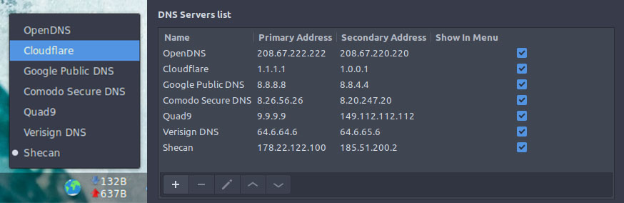

Cinnamon DNS Changer applet
=========================

A simple applet for fast changing dns server in /resolv.conf




Usage
-----

```
cd ~/.local/share/cinnamon/applets
git clone https://github.com/nos486/cinnamon-dns-changer.git
```

Issues
------

Please report issues [here](https://github.com/nos486/cinnamon-dns-changer/issues).

License
-------

This software is released under the GNU General Public License v3.0, see `LICENSE` for details.